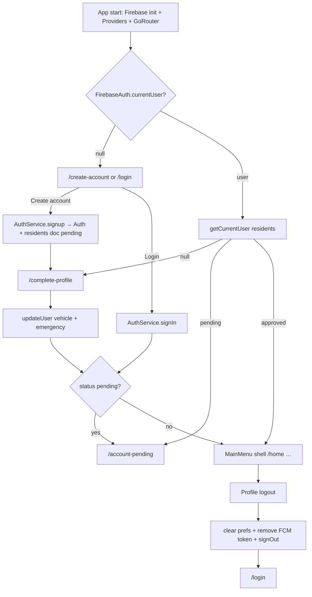

# Portalix MX — Account Lifecycle Overview

End-to-end flow from app start through account creation, login, profile completion, admin approval, authenticated use, and logout.

**Auth stack:** Firebase Authentication (email/password only) + Cloud Firestore resident profiles + GoRouter redirects driven by `authStateChanges()`.

There is no splash screen, social login, email verification, or in-app password change. Account deletion exists in the service layer but has no UI.

---

## Architecture map

| Layer | Path |
|--------|------|
| Entry | `lib/main.dart` |
| Router | `lib/router/app_router.dart` |
| Auth refresh | `lib/router/go_router_refresh.dart` |
| Auth provider | `lib/providers/authentication_provider/authentication_provider.dart` |
| Auth service | `lib/services/auth_service/auth_service.dart` |
| Profile provider / service | `lib/providers/profile_provider.dart`, `lib/services/profile_service/profile_service.dart` |
| User model | `lib/core/models/user_model.dart` |
| Society model | `lib/core/models/society_model.dart` |
| Firestore constants | `lib/core/res/firebase_constant.dart` |
| Validators | `lib/core/validators/validators.dart` |
| Push / FCM | `lib/services/push_notification_service/push_notification_service.dart` |

### Backend data

| Resource | Purpose |
|----------|---------|
| Firestore `residents` | User profile docs keyed by Firebase UID |
| Firestore `societies` | Society list and membership target |
| Storage `residents/profile_pictures/{uid}/…` | Profile images |
| Resident field `token` | FCM device token (merged on login; deleted on logout) |

---

## End-to-end flow

---

## 1. App entry and initial routing

### Startup (`lib/main.dart`)

1. `WidgetsFlutterBinding.ensureInitialized()`
2. `Firebase.initializeApp(...)`
3. Register FCM background handler
4. `PushNotificationService.instance.initialize(router: appRouter)` — also listens to `FirebaseAuth.authStateChanges()` for token sync
5. `runApp(MultiProvider(...))` with:
   - `AuthenticationProvider`
   - `HomeProvider`
   - `LocaledProvider`
   - `ProfileProvider`
6. `MyApp` → `MaterialApp.router(routerConfig: appRouter)`

There is **no splash screen**.

### Router gate (`lib/router/app_router.dart`)

- `initialLocation`: `/create-account`
- `refreshListenable`: `GoRouterRefreshStream(FirebaseAuth.instance.authStateChanges())` — any auth change re-runs `redirect`

### Redirect state machine

| Condition | Destination |
|-----------|-------------|
| No Firebase user, not on signup/login/forgot/complete-profile | → `/login` |
| Firebase user, no Firestore `residents` doc | → `/complete-profile` |
| Profile `status == pending` | → `/account-pending` (may stay on complete-profile) |
| Profile `status == approved` and on pending/login/signup | → `/home` |
| Otherwise | stay on current route |

---

## 2. Account creation

### Screen

- **File:** `lib/presentation/screens/authentication/create_account_page.dart`
- **Route:** `/create-account`
- **Class:** `CreateAccountPage`

### Data collected

| Field | Notes |
|-------|--------|
| Profile photo | Gallery via `AuthenticationProvider.onPickImageTap` — required in provider |
| Full name | Validated (`validateFullName`) |
| Email | Validated (`validateEmail`) |
| Password | Required only (`validatePassword`) |
| Society | Dropdown from `AuthenticationProvider.societies` |

### Flow

1. UI `_onSignupTap()` → form validate → `AuthenticationProvider.onCreateAccountTap(...)`
2. Provider → `AuthService.signup(...)`
3. `AuthService.signup`:
   - `FirebaseAuth.createUserWithEmailAndPassword`
   - Upload profile picture to Storage → download URL
   - Build `UserModel` with default `status: UserStatus.pending`
   - Write `residents/{uid}` via `user.toMap()`
4. On success: navigate to `/complete-profile`
5. Link to login: `context.go('/login')`

### Firestore fields at signup

`userID`, `userName`, `emailAddress`, `phoneNum`, `societyID`, `createdAt`, `profileImg`, `vehicleInformation`, `emergencyContacts`, `status` (`0` = pending), `zkPin`, `zkProvisionedAt`, `zkAccLevelIds`

### Email verification

**Not implemented** — no `sendEmailVerification` / `emailVerified` checks.

---

## 3. Login

### Screen

- **File:** `lib/presentation/screens/authentication/login_page.dart`
- **Route:** `/login`
- **Class:** `LoginPage`

### Method

**Email + password only** via `AuthService.signIn` → `signInWithEmailAndPassword`.  
No Google / Apple / Facebook / phone auth.

### Flow

1. `_onLoginTap()` → `AuthenticationProvider.onSignInTap` → `AuthService.signIn`
2. UI navigates toward `/home`; GoRouter redirect may send pending users to `/account-pending`
3. Errors mapped in `_handleFirebaseAuthError` (`invalid-email`, `user-not-found`, `wrong-password`, `invalid-credential`, etc.)

### Legacy leftovers (not in live flow)

- Commented REST login / OTP path in `login_page.dart`
- OTP shell: `lib/presentation/screens/authentication/otp_page.dart` (`/verify-otp`) — verify handler commented out

---

## 4. Post-registration onboarding

### A. Complete profile

- **File:** `lib/presentation/screens/complete_profile_screen/complete_profile_screen.dart`
- **Route:** `/complete-profile`
- **Class:** `CompleteProfileScreen`

Collects: phone, vehicle (name, color, license plate, registration), emergency contact.

Submit → `AuthenticationProvider.onCompleteProfileTap` → load user → `copyWith(vehicleInformation, emergencyContacts)` → `AuthService.updateUser` → navigate toward `/home`.

**Note:** `phoneNum` is passed into `onCompleteProfileTap` but is not applied in `copyWith`, so phone from this screen is not persisted.

Society was already chosen at signup.

### B. Admin approval gate

- **File:** `lib/presentation/screens/account_pending/account_pending_page.dart`
- **Route:** `/account-pending`
- **Class:** `PendingRequestPage`

Shows a pending message with society name from `AuthService.getSociety()` (user’s `societyID` → `societies` doc).

| `UserStatus` | Index | Access |
|--------------|-------|--------|
| `pending` | 0 | Blocked from main app by redirect |
| `approved` | 1 | Full access |

Approval is **external** (admin updates Firestore `status`). The app only reads it. Persona is a **resident**; access is gated by approval status (not a multi-role system).

---

## 5. Session management

| Concern | Behavior |
|---------|----------|
| Persistence | Firebase Auth SDK (native); no custom session store |
| Router reactivity | `GoRouterRefreshStream` on `authStateChanges()` |
| Profile cache | `ProfileProvider` loads once in constructor; not re-bound to auth events |
| ID token refresh | Handled by Firebase Auth internally |
| FCM | On auth user present / token refresh → merge `token` into `residents/{uid}`; logout deletes field |
| SharedPreferences | Cleared on logout; legacy `ApiService` bearer `"token"` is not set by current Firebase login |

Logout UI calls `FirebaseAuth.instance.signOut()` directly (`AuthService.signOut()` exists but is unused by UI).

---

## 6. Authenticated experience (brief)

Shell: `StatefulShellRoute.indexedStack` → `MainMenuPage` (`lib/presentation/screens/main_menu/main_menu.dart`)

| Tab | Route | Screen |
|-----|-------|--------|
| 0 | `/home` | `HomePage` — welcome + guests/visitors |
| 1 | `/payments-billing` | `PaymentsMenu` |
| 2 | `/maintenance` | `MaintenanceMenu` |
| 3 | `/access-requests` | `AccessMenu` |
| 4 | `/profile-menu` | `ProfileMenu` |

Identity for feature APIs typically comes from `UserService.getCurrentUser()` / `FirebaseAuth.currentUser!.uid`, scoped to the resident’s society. Approval still gates some features (e.g. access QR checks `user.isApproved`).

---

## 7. Account / profile management

### Profile menu

- **File:** `lib/presentation/screens/main_menu/profile_menu/profile_page.dart`
- **Class:** `ProfileMenu`

Shows avatar/name from `ProfileProvider`. Links include My Access QR, Directory, Calendar, Polls, Guards, Emergency, and **Logout**. Some items (e.g. car pooling, privacy) are placeholders.

### Edit profile

- **File:** `lib/presentation/screens/main_menu/profile_menu/edit_profile_page.dart`
- **Route:** `/edit-profile`

`ProfileProvider.onUpdateTap` → optional Storage image update → Firestore `ProfileService.updateUser`.

Editable: name, phone, vehicle fields, profile image. **No password-change UI.**

### Related user get/update services

- `AuthService.getCurrentUser` / `updateUser`
- `ProfileService.getCurrentUser` / `updateUser`
- `UserService.getCurrentUser` / `updateUser`

---

## 8. Logout

**Entry:** `ProfileMenu._onLogoutTap` in `profile_page.dart`

Sequence:

1. `SharedPreferences.clear()`
2. `PushNotificationService.instance.removeTokenForSignOut()` — deletes Firestore `token` for current UID
3. `FirebaseAuth.instance.signOut()`
4. `context.go('/login')`

GoRouter then keeps unauthenticated users on login / signup / forgot / complete-profile only.

**Not cleared explicitly:** in-memory provider state (`ProfileProvider.user`, `HomeProvider` lists, `AuthenticationProvider.pickedImage` / `selectedSociety`) may linger until process restart unless screens re-fetch.

---

## 9. Account deletion

**Service only** — `AuthService.deleteAccount()`:

1. Delete `residents/{uid}`
2. `FirebaseAuth.currentUser!.delete()`
3. Handles `requires-recent-login` (rethrow)
4. Companion: `reauthenticateWithPassword(password)` via `EmailAuthProvider.credential`

**No screen, dialog, or button** calls these methods.

---

## 10. Password reset

- **File:** `lib/presentation/screens/authentication/forget_password_page.dart`
- **Route:** `/forget-password` (from login “Forget password”)
- **Class:** `ForgetPasswordPage`

Flow: enter email → `FirebaseAuth.instance.sendPasswordResetEmail(...)` → success snackbar → pop.

No in-app “change password while logged in”.

---

## Key classes & methods

| Class | Role |
|-------|------|
| `AuthenticationProvider` | `onPickImageTap`, `onCreateAccountTap`, `onCompleteProfileTap`, `onSignInTap`, `_initSocieties`, `onSelectSocietyTap` |
| `AuthService` | `signup`, `signIn`, `signOut`, `deleteAccount`, `reauthenticateWithPassword`, `getCurrentUser`, `updateUser`, `getSocieties`, `getSociety`, `updateProfilePicture` |
| `ProfileProvider` | `_initProfile`, `onPickImageTap`, `onUpdateTap` |
| `ProfileService` | `getCurrentUser`, `updateUser` |
| `UserService` | `getCurrentUser`, `updateUser`, `getSocietyByID` |
| `PushNotificationService` | `initialize`, auth-driven token sync, `removeTokenForSignOut` |
| `GoRouterRefreshStream` | Stream → `notifyListeners` for router refresh |
| `UserModel` | `status`, `isApproved`, `hasZkAccess`, `toMap` / `fromMap` / `copyWith` |

---

## Route reference (`NamedRoutes`)

| Name | Path |
|------|------|
| `createAccount` | `/create-account` |
| `login` | `/login` |
| `forgetPassword` | `/forget-password` |
| `completeProfile` | `/complete-profile` |
| `accountPending` | `/account-pending` |
| `verifyOtp` | `/verify-otp` (legacy / unused) |
| `home` | `/home` |
| `paymentsBilling` | `/payments-billing` |
| `maintenance` | `/maintenance` |
| `accessRequests` | `/access-requests` |
| `profile` | `/profile-menu` |
| `editProfile` | `/edit-profile` |
| `myAccessQr` | `/my-access-qr` |

---

## Known gaps

1. No splash — cold start lands on `/create-account`; redirect may bounce to `/login`, `/home`, or `/account-pending`.
2. OTP + REST login leftovers remain in the codebase but are inactive.
3. Complete-profile phone number is not saved.
4. `deleteAccount` / `reauthenticateWithPassword` have no UI.
5. `AuthService.signOut` is unused by the logout UI.
6. No email verification, social auth, or logged-in password change.
7. Single app persona: resident, gated by admin-set `UserStatus` on Firestore.
